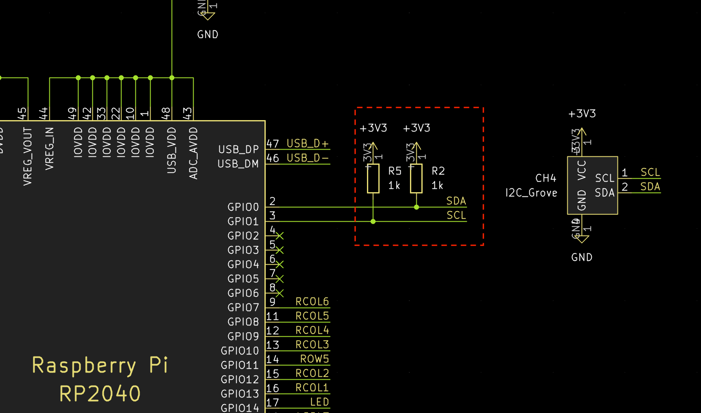

# StickPoint Firmware

Pointer module with joystick.

ジュイスティックを使ったポインターモジュール


> [!IMPORTANT]
> This module does not replicate the feel of Trackpoint. このモジュールはトラックポイントの操作性を再現するものではありません。

> [!IMPORTANT]
> KiCad ファイルのスナップショットも含まれていますが、Booth での購入など作者 74th から入手したもののみサポートします。

On sale at Booth. Booth にて販売中 https://74th.booth.pm/items/5404009

## features / 特徴

- I2C connection, Pimoroni Trackball module PIM447 compatible
- Grove I2C socket for M5Stack etc.
- Double speed mode by moving the trackball twice (ex: ←, center, ←)

### Japanese

- I2C 接続、Pimoroni Trackball モジュール PIM447 互換
- Grove の I2C ソケットをもち、M5Stack などを接続可能
- 2 回、コツコツと、←、中央、← の用に動かすと、倍速モードになります

## I2C Interface / I2C インターフェイス

Connect the I2C Grove port or the through-hole on the board to a port on the microcontroller where I2C is available. I2C Grove ポート、もしくは基板のスルーホールを、マイコンの I2C が利用できるポートに接続してください。

### StickPointV v1.1.0

I2C の SDA、SCL は、モジュール内で 1kΩ 抵抗で VCC 電圧にプルアップされています。


### StickPointV v1.0.0


Note that I2C SDA and SCL require a pull-up. RP2040 requires an external pull-up resistor of about 1 kΩ. When operating at 3.3 V, connect a 1 kΩ resistor between the 3.3 V supply and SDA and SCL. なお、I2C の SDA、SCL にはプルアップが必要です。RP2040 では外部の 1kΩ 程度のプルアップ抵抗が必要になります。3.3V で動作させる場合は、3.3V 電源と、SDA、SCL の間に 1kΩ の抵抗を接続してください。



## I2C Protocol / I2C 通信仕様

Address: 0x0A

When a send instruction is issued, the following 5 bytes are returned. 送信指示を出すと、以下の 5 バイトを返します。

- 1: left
- 2: right
- 3: down
- 4: up
- 5: 0

## Documents

- StickPointV (CH32V003)
  - v1.1.0
    - Semantics: [PDF](docs/stickpointv-ch32v003-v1.1.0-semantics.pdf), [KiCanvas](https://kicanvas.org/?github=https%3A%2F%2Fgithub.com%2F74th%2Fstickpoint-firmware%2Fblob%2Fmain%2Fdocs%2Fstickpointv-ch32v003-v1.1.0-semantics.kicad_sch), [kicad_sch](./docs/stickpointv-ch32v003-v1.1.0-semantics.kicad_sch)
    - PCB: [KiCanvas](https://kicanvas.org/?github=https%3A%2F%2Fgithub.com%2F74th%2Fstickpoint-firmware%2Fblob%2Fmain%2Fdocs%2Fstickpointv-ch32v003-v1.1.0-pcb.kicad_pcb)
    - changed
      - add I2C pull-up resistor
      - add Qwiic connector
  - v1.0.0
    - Semantics: [PDF](docs/stickpointv-ch32v003-v1.0.0-semantics.pdf), [KiCanvas](https://kicanvas.org/?github=https%3A%2F%2Fgithub.com%2F74th%2Fstickpoint-firmware%2Fblob%2Fmain%2Fdocs%2Fstickpointv-ch32v003-v1.0.0-semantics.kicad_sch), [kicad_sch](./docs/stickpointv-ch32v003-v1.0.0-semantics.kicad_sch)
    - PCB: [KiCanvas](https://kicanvas.org/?github=https%3A%2F%2Fgithub.com%2F74th%2Fstickpoint-firmware%2Fblob%2Fmain%2Fdocs%2Fstickpointv-ch32v003-v1.0.0-pcb.kicad_pcb)
- ⚠︎Deprecated⚠︎ StickPoint (ATTiny402)
  - v1.0.1
    - Semantics: [PDF](docs/stickpoint-attiny402-v1.0.1-semantics.pdf), [KiCanvas](https://kicanvas.org/?github=https%3A%2F%2Fgithub.com%2F74th%2Fstickpoint-firmware%2Fblob%2Fmain%2Fdocs%2Fstickpoint-attiny402-v1.0.1-semantics.kicad_sch), [kicad_pcb](./docs/stickpointv-ch32v003-v1.0.0-pcb.kicad_pcb)
    - PCB: [KiCanvas](https://kicanvas.org/?github=https%3A%2F%2Fgithub.com%2F74th%2Fstickpoint-firmware%2Fblob%2Fmain%2Fdocs%2Fstickpoint-attiny402-v1.0.1-pcb.kicad_pcb)

## How to use QMK Firmware with RP2040 / RP2040 での QMK Firmware での使用方法

Connect SDA and SCL of the module to the I2C capable ports on the RP2040. Also connect GND and VCC (3.3V/5V). RP2040 の I2C が使えるポートに、モジュールの SDA、SCL を接続します。また、GND、VCC（3.3V/5V）も接続してください。

RP2040 には、2 つの I2C の I2C0 と I2C1 があります。どちらを利用するかはポートにより異なります。RP2040 のドキュメントから確認してください。

### rules.mk

Add the following statement. 以下の記述を追加してください。

```
POINTING_DEVICE_ENABLE = yes
I2C_DRIVER_REQUIRED = yes
POINTING_DEVICE_DRIVER = pimoroni_trackball
```

### halconf.h

If halconf.h does not exist, create it and add the following statement. halconf.h がない場合作成して、以下の記述を追加してください。

```
#pragma once

#define HAL_USE_I2C TRUE

#include_next <halconf.h>
```

### mcuconf.h

If mcuconf.h does not exist, create it and add the following statement. mcuconf.h がない場合作成して、以下の記述を追加してください。

The TRUE and FALSE values for RP_I2C_USE_I2C0 and RP_I2C_USE_I2C1 should be changed according to I2C0 and I2C1 used. RP_I2C_USE_I2C0、RP_I2C_USE_I2C1 の TRUE、FALSE は利用する I2C0、I2C1 によって変更してください。

```
#pragma once

#include_next <mcuconf.h>

#undef RP_I2C_USE_I2C0
#define RP_I2C_USE_I2C0 TRUE

#undef RP_I2C_USE_I2C1
#define RP_I2C_USE_I2C1 FALSE
```

### config.h

以下の記述を追加してください。

I2C1_SCL_PIN、I2C1_SDA_PIN には接続した I2C ポートを指定してください。

```
#pragma once

#define PIMORONI_TRACKBALL_ADDRESS 0x0A
#define I2C1_SCL_PIN GP1
#define I2C1_SDA_PIN GP0
#define I2C_DRIVER I2CD0
#define F_SCL 100000
#define PIMORONI_TRACKBALL_SCALE 5
```

Even when I2C0 is used, it seems to be described in I2C1_SCL_PIN and I2C1_SDA_PIN. I2C0 を利用する場合であっても、I2C1_SCL_PIN、I2C1_SDA_PIN に記述するようです。

PIMORONI_TRACKBALL_SCALE is a value that is multiplied by the acquired value. Use it to adjust the amount of movement. PIMORONI_TRACKBALL_SCALE は、取得した値に対してかけ算される値です。移動量の調整に利用してください。

### Scroll / スクロール

The QMK Firmware documentation describes how to implement scrolling by clicking and moving. Please refer to this document. QMK Firmware のドキュメントにはクリックしながら移動するとスクロールする様に実装する方法について記述があります。こちらを参考にしてみてください。

https://docs.qmk.fm/#/feature_pointing_device?id=drag-scroll-or-mouse-scroll

https://docs.qmk.fm/#/feature_pointing_device?id=advanced-drag-scroll

### Example / 例

Sparrow60C https://github.com/74th/qmk_firmware_sparrow_keyboard/tree/sparrow/keyboards/sparrow60c

## How to update Firmware / ファームウェアの更新方法

### StickPointV (CH32V003)

WCH-LinkE is required to use CH32V003. CH32V003 を使用するため、WCH-LinkE が必要です。

WCH-LinkE is available at the following stores. Please note that similar WCH-Link (without E) is not supported. WCH-LinkE は、以下のショップで購入可能です。類似品 WCH-Link(E のないもの) は対応していませんので、ご注意ください。

- WCH-LinkE (秋月電子通商) https://akizukidenshi.com/catalog/g/g118065/
- WCH-LinkE (Aliexpress) https://www.aliexpress.com/item/1005005180653105.html
- CH32V003 Kit (Aliexpress WCH-Official Store) https://www.aliexpress.com/item/1005004895791296.html

Connect the WCH-LinkE to the following 3 ports on the module. WCH-LinkE とモジュールの以下の 3 つのポートを接続してください。

- VCC, 3.3V/5V
- GND
- SWDIO

If the Grove port is already providing power, only the following two ports are needed. Grove ポートで既に電源を供給している場合は、以下の 2 つのポートだけで良いです。

- GND
- SWDIO


This firmware uses ch32v003fun, please refer to the ch32v003fun documentation for how to set up the ch32v003fun development environment. このファームウェアは ch32v003fun を使用しています。ch32v003fun の開発環境の整え方は ch32v003fun のドキュメントを参照して下さい。

https://github.com/cnlohr/ch32v003fun

The software to upload the firmware is minichlink, which is included in ch32v003fun. minichlink should be built and placed in the PATH. ファームウェアをアップロードするソフトウェアには minichlink を使用します。minichlink は ch32v003fun に含まれています。minichlink をビルドしてパスの通る所においてください。

In the stickpointv-ch32v003j4m6 directory, execute the following command. stickpointv-ch32v003j4m6 のディレクトリで、以下のコマンドを実行します。

```
make
```

Fine adjustment of the movement amount is specified by REDUCE_LEVEL. 移動量の微調整は REDUCE_LEVEL で指定します。

### ⚠︎Deprecated⚠︎ StickPoint (ATTiny402)

A UPDI programmer is required to use the ATTiny402. ATTiny402 を使用するため、UPDI プログラマが必要です。
The UPDI programmer can be produced using USB serial conversion. Please check here. UPDI プログラマは、USB シリアル変換を使って制作可能です。こちらを確認ください。

https://github.com/microchip-pic-avr-tools/pymcuprog#serial-port-updi-pyupdi

Use PlatformIO, install the extension PlatformIO in VS Code. PlatformIO を使います。VS Code に拡張機能 PlatformIO をインストールしてください。

Open the stickpoint-attiny402 directory as a workspace in VS Code (open the stickpoint-attiny402 directory with the command "File: Open Folder..."). VS Code で joypoint ディレクトリをワークスペースとして開きます（コマンド「ファイル：フォルダーを開く（File: Open Folder...）」で joypoint ディレクトリを開きます）

Adjust upload_port, upload_command, etc. in platform.ini and upload. platform.ini の upload_port、upload_command などを調整し、アップロードをしてください。

## Tuning Guide / チューニングガイド

The easiest way to tune the amount of movement is to control the amount of movement on the keyboard firmware side; in the case of QMK Firmware, you can set PIMORONI_TRACKBALL_SCALE, a value that is multiplied by the acquired amount of movement. If you want to increase the amount of movement, increase the number; if you want to decrease the amount of movement, decrease the number.

If you want to control the amount of movement in a more detailed manner, there is a value called REDUCE_LEVEL that is controlled on the StickPoint side. The amount of movement is controlled by dividing the calculated amount of movement by this value. If this value is increased, the amount of movement becomes smaller, and if it is decreased, the amount of movement becomes larger.

StickPoint uses the read_analog function to convert the value into a 4-step amount. I did this because I thought that any finer control would be difficult with this device. These thresholds are set by StickPoint's high_zone, deadzone, and middle. Fine tuning can be done by changing this value or changing the value to be set. Currently, the values are converted to four steps of 0, 1, 3, and 5. If you wish to control the values more finely than that, please change them in conjunction with REDUCE_LEVEL.

🇯🇵

最も簡単に移動量をチューニングする方法は、キーボードファームウェア側で移動量を制御することです。QMK Firmware の場合には、PIMORONI_TRACKBALL_SCALE という取得した移動量にかけ算する値を設定できます。移動量を増やしたい場合には数字を大きく、減らしたい場合には小さくしてください。

寄り細かく移動量を制御する場合、StickPoint の側で制御している REDUCE_LEVEL という値があります。算出した移動量にたいして、この値で割ることで移動量を制御しています。この値を大きくすると移動量が小さくなり、小さくすると移動量が大きくなります。

StickPoint は read_analog 関数で、4 段階の量に変換しています。それ以上の細かい制御はこのデバイスでは難しいと、私は考えたためです。この閾値は、StickPoint の high_zone、deadzone、middle で設定しています。この値を変更したり、設定する値を変更することで微調整が可能です。現在は、0、1、3、5 の 4 段階の値に変換していますが、それより細かく制御したい場合は、REDUCE_LEVEL と合わせて変更してください。

## License

MIT License

I would be happy if you would not sell the device. Booth ショップで扱っているため、販売はしないでいただけるとありがたいです。
