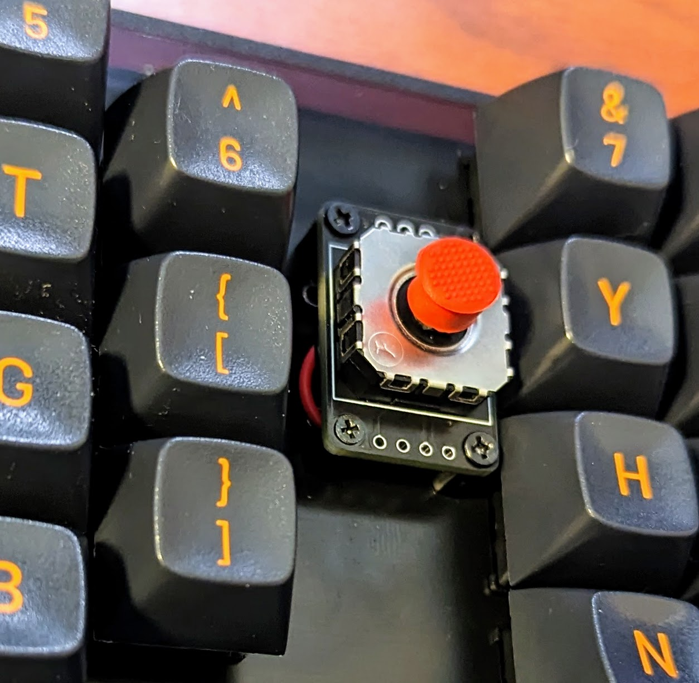

# StickPoint Firmware

Pointer module with joystick.

ジュイスティックを使ったポインターモジュール



> [!IMPORTANT]
> This module does not replicate the feel of Trackpoint. このモジュールはトラックポイントの操作性を再現するものではありません。

> [!IMPORTANT]
> KiCad ファイルのスナップショットも含まれていますが、Booth での購入など作者 74th から入手したもののみサポートします。

## features 特徴

- I2C connection, Pimoroni Trackball module PIM447 compatible
- Grove I2C socket for M5Stack etc.
- Double speed mode by moving the trackball twice (ex: ←, center, ←)

### Japanese

- I2C 接続、Pimoroni Trackball モジュール PIM447 互換
- Grove の I2C ソケットをもち、M5Stack などを接続可能
- 2 回、コツコツと、←、中央、← の用に動かすと、倍速モードになります

## I2C Connection

Address: 0x0A

When a send instruction is issued, the following 5 bytes are returned. 送信指示を出すと、以下の 5 バイトを返します。

- 1: left
- 2: right
- 3: down
- 4: up
- 5: 0

## Documents

- StickPointV (CH32V003)
  - v1.0.0
    - Semantics: [PDF](docs/stickpointv-ch32v003-v1.0.0-semantics.pdf), [KiCanvas](https://kicanvas.org/?github=https%3A%2F%2Fgithub.com%2F74th%2Fstickpoint-firmware%2Fblob%2Fmain%2Fdocs%2Fstickpointv-ch32v003-v1.0.0-semantics.kicad_sch)
    - PCB: [KiCanvas](https://kicanvas.org/?github=https%3A%2F%2Fgithub.com%2F74th%2Fstickpoint-firmware%2Fblob%2Fmain%2Fdocs%2Fstickpointv-ch32v003-v1.0.0-pcb.kicad_pcb)
- StickPoint (ATTiny402)
  - v1.0.1
    - Semantics: [PDF](docs/stickpoint-attiny402-v1.0.1-semantics.pdf), [KiCanvas](https://kicanvas.org/?github=https%3A%2F%2Fgithub.com%2F74th%2Fstickpoint-firmware%2Fblob%2Fmain%2Fdocs%2Fstickpoint-attiny402-v1.0.1-semantics.kicad_sch)
    - PCB: [KiCanvas](https://kicanvas.org/?github=https%3A%2F%2Fgithub.com%2F74th%2Fstickpoint-firmware%2Fblob%2Fmain%2Fdocs%2Fstickpoint-attiny402-v1.0.1-pcb.kicad_pcb)

## How to update Firmware ファームウェアの更新方法

### StickPointV (CH32V003)

WCH-LinkE is required to use CH32V003. CH32V003 を使用するため、WCH-LinkE が必要です。

WCH-LinkE is available at the following stores. Please note that similar WCH-Link (without E) is not supported. WCH-LinkE は、以下のショップで購入可能です。類似品 WCH-Link(E のないもの) は対応していませんので、ご注意ください。

- WCH-LinkE (秋月電子通商) https://akizukidenshi.com/catalog/g/gM-18065/
- WCH-LinkE (Aliexpress) https://www.aliexpress.com/item/1005005180653105.html
- CH32V003 Kit (Aliexpress WCH-Official Store) https://www.aliexpress.com/item/1005004895791296.html

Connect the WCH-LinkE to the following 3 ports on the module. WCH-LinkE とモジュールの以下の 3 つのポートを接続してください。

- VCC, 3.3V/5V
- GND
- SWDIO

If the Grove port is already providing power, only the following two ports are needed. Grove ポートで既に電源を供給している場合は、以下の 2 つのポートだけで良いです。

- GND
- SWDIO


This firmware uses ch32v003fun, please refer to the ch32v003fun documentation for how to set up the ch32v003fun development environment. このファームウェアは ch32v003fun を使用しています。ch32v003fun の開発環境の整え方は ch32v003fun のドキュメントを参照して下さい。

https://github.com/cnlohr/ch32v003fun

The software to upload the firmware is minichlink, which is included in ch32v003fun. minichlink should be built and placed in the PATH. ファームウェアをアップロードするソフトウェアには minichlink を使用します。minichlink は ch32v003fun に含まれています。minichlink をビルドしてパスの通る所においてください。

In the stickpointv-ch32v003j4m6 directory, execute the following command. stickpointv-ch32v003j4m6 のディレクトリで、以下のコマンドを実行します。

```
make
```

### StickPoint (ATTiny402)

A UPDI programmer is required to use the ATTiny402. ATTiny402 を使用するため、UPDI プログラマが必要です。
The UPDI programmer can be produced using USB serial conversion. Please check here. UPDI プログラマは、USB シリアル変換を使って制作可能です。こちらを確認ください。

https://github.com/microchip-pic-avr-tools/pymcuprog#serial-port-updi-pyupdi

Use PlatformIO, install the extension PlatformIO in VS Code. PlatformIO を使います。VS Code に拡張機能 PlatformIO をインストールしてください。

Open the stickpoint-attiny402 directory as a workspace in VS Code (open the stickpoint-attiny402 directory with the command "File: Open Folder..."). VS Code で joypoint ディレクトリをワークスペースとして開きます（コマンド「ファイル：フォルダーを開く（File: Open Folder...）」で joypoint ディレクトリを開きます）

Adjust upload_port, upload_command, etc. in platform.ini and upload. platform.ini の upload_port、upload_command などを調整し、アップロードをしてください。

## License

MIT

I would be happy if you would not sell the device.
